# 🏫 RBMI Admission Hub (CRM) — Complete Project Workflow

> **Version:** 3.0.0 | **Institute:** Rakshpal Bahadur Management Institute (Bareilly & Greater Noida)
> **Modeled After:** Meritto (formerly NoPaperForms)

---

## 📋 Table of Contents

1. [Tech Stack Overview](#1--tech-stack-overview)
2. [Project Directory Structure](#2--project-directory-structure)
3. [System Architecture Diagram](#3--system-architecture-diagram)
4. [Application Boot & Startup Flow](#4--application-boot--startup-flow)
5. [Authentication & Authorization Flow](#5--authentication--authorization-flow)
6. [Lead Management Workflow](#6--lead-management-workflow)
7. [Multi-Source Lead Ingestion](#7--multi-source-lead-ingestion)
8. [Counselor Admission Pipeline](#8--counselor-admission-pipeline)
9. [Student Self-Service Portal](#9--student-self-service-portal)
10. [Marketing & Communication Engine](#10--marketing--communication-engine)
11. [AI Assistant (Asha AI)](#11--ai-assistant-asha-ai)
12. [Payment & Fee Management](#12--payment--fee-management)
13. [Database Schema](#13--database-schema)
14. [Complete API Endpoints](#14--complete-api-endpoints)
15. [Frontend Pages & Components](#15--frontend-pages--components)
16. [Deployment Architecture](#16--deployment-architecture)

---

## 1. 🛠 Tech Stack Overview

### Frontend
| Technology | Purpose |
|---|---|
| **Vite 6** | Build tool & Dev server (Port 3005) |
| **Vanilla ES6+ Modules** | No React/Vue — Custom SPA with hash router |
| **Chart.js 4** | Line, Doughnut, Bar, Funnel charts |
| **Lucide Icons** | Tree-shaken SVG icon library |
| **CSS3 Custom Properties** | Design tokens, Dark Mode, Responsive layout |
| **Service Worker (PWA)** | Offline caching & installable app |

### Backend
| Technology | Purpose |
|---|---|
| **Node.js + Express 5** | API server (Port 3001) |
| **Supabase (PostgreSQL)** | Primary database with Row Level Security |
| **JSON Fallback (data.json)** | In-memory DB when Supabase is unavailable |
| **JWT (HS256)** | Token-based authentication |
| **Multer** | File upload handler (10MB limit) |

### External Services
| Service | Provider | Purpose |
|---|---|---|
| **Email** | Gmail SMTP (Nodemailer) | Welcome emails, stage notifications |
| **SMS** | Twilio | OTP, lead alerts, bulk messaging |
| **WhatsApp** | Twilio WhatsApp API | Template messages, reminders |
| **Video Calls** | Zoom API | Counseling meetings |
| **OCR** | Tesseract.js | Document text extraction |
| **AI Chat** | OpenAI / Groq (gpt-4o-mini) | Asha AI assistant |
| **Payments** | Razorpay (Mock) | Fee collection gateway |

---

## 2. 📁 Project Directory Structure

```
merrito-/
├── index.html                 # App shell with 3D boot animation
├── package.json               # Dependencies & scripts
├── vite.config.js             # Vite config (proxy /api → :3001)
├── vercel.json                # Vercel deployment config
├── .env                       # Environment variables (secrets)
│
├── public/                    # Static assets
│   ├── favicon.svg            # Browser tab icon
│   ├── logo.png               # RBMI institutional logo
│   ├── manifest.json          # PWA manifest
│   ├── register.html          # Public student registration form
│   ├── sw.js                  # Service Worker (offline caching)
│   └── widgets/
│       └── rbmi-chat-widget.js # Embeddable website chat widget
│
├── src/                       # Frontend source code
│   ├── main.js                # App bootstrap & route registry
│   ├── router.js              # Hash-based SPA router with RBAC
│   ├── components/            # Reusable UI components
│   │   ├── sidebar.js         # Navigation sidebar (role-based)
│   │   ├── header.js          # Top bar (search, dark mode, notifications)
│   │   ├── charts.js          # Chart.js wrappers
│   │   ├── modal.js           # Reusable modal dialog
│   │   ├── ashaAi.js          # Floating AI chat assistant
│   │   └── utils.js           # Formatting helpers
│   ├── lib/                   # Client libraries
│   │   ├── api.js             # 70+ API client functions
│   │   ├── auth.js            # Session management (sessionStorage)
│   │   ├── supabase.js        # Browser Supabase client
│   │   └── icons.js           # Lucide icon renderer
│   ├── pages/                 # 29 page components
│   │   ├── login.js           # Login with 3D canvas backdrop
│   │   ├── dashboard.js       # Admin KPI dashboard
│   │   ├── leads.js           # Lead management console
│   │   ├── pipeline.js        # Kanban drag-and-drop board
│   │   ├── applications.js    # Application & document verification
│   │   ├── studentPortal.js   # Student self-service hub
│   │   ├── marketing.js       # Multi-channel marketing center
│   │   ├── payments.js        # Fee & payment ledger
│   │   ├── reports.js         # Analytics & conversion funnel
│   │   ├── settings.js        # 9-tab admin configuration
│   │   └── ... (19 more pages)
│   └── styles/                # 17 CSS stylesheets
│       ├── global.css         # Base tokens & variables
│       ├── darkmode.css       # Dark mode overrides
│       └── ... (module-specific styles)
│
├── server/                    # Backend source code
│   ├── index.js               # Express app (2400+ lines, all routes)
│   ├── auth.js                # JWT auth, scrypt hashing, RBAC
│   ├── supabase.js            # Supabase data access layer
│   ├── db.js                  # JSON fallback database engine
│   ├── appStore.js            # Business logic (settings, letters, portal)
│   ├── cron.js                # Background scheduled tasks
│   ├── publishers.js          # Third-party lead adapters
│   ├── validate.js            # Payload validation (Zod)
│   ├── data.json              # Local JSON database file
│   ├── controllers/           # Domain controllers
│   │   ├── aiController.js    # Asha AI chat handler
│   │   └── leadDistributionController.js
│   ├── middlewares/           # Error handling & Zod validation
│   ├── routes/                # Modular Express routers
│   │   ├── index.js           # Router aggregator
│   │   └── formBuilderRoutes.js
│   ├── services/              # External integrations
│   │   ├── ocrService.js      # Tesseract.js OCR
│   │   ├── smsService.js      # Twilio SMS
│   │   ├── whatsappService.js # Twilio WhatsApp
│   │   └── zoomService.js     # Zoom video meetings
│   └── utils/
│       └── emailService.js    # Gmail SMTP email sender
│
├── supabase/migrations/       # Database schema
│   ├── 001_schema.sql         # Core tables & triggers
│   ├── 002_real_mode_policies.sql  # Row Level Security
│   ├── 003_fix_auth_trigger.sql
│   ├── 004_lead_intelligence.sql   # Scoring & attribution
│   └── 005_workflows_and_letters.sql
│
├── scripts/
│   └── seed-real-users.mjs    # Seed admin/counselor/student accounts
│
└── api/
    └── index.js               # Vercel serverless entry point
```

---

## 3. 🏗 System Architecture Diagram

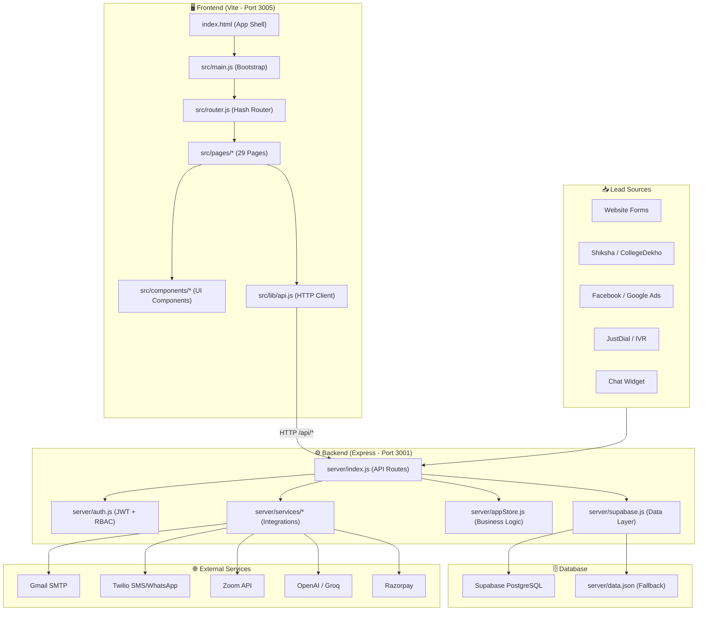

---

## 4. 🚀 Application Boot & Startup Flow

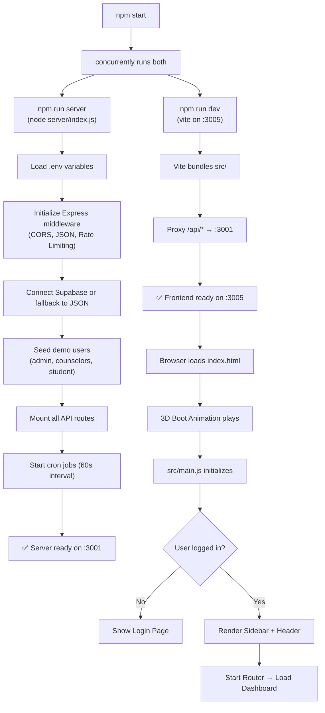

### NPM Scripts
| Command | Description |
|---|---|
| `npm start` | Starts both frontend & backend concurrently |
| `npm run dev` | Vite dev server only (frontend) |
| `npm run server` | Express API server only (backend) |
| `npm run build` | Production build → `dist/` |
| `npm run seed:users` | Seed real users into Supabase |
| `npm test` | Run validation unit tests |

---

## 5. 🔐 Authentication & Authorization Flow

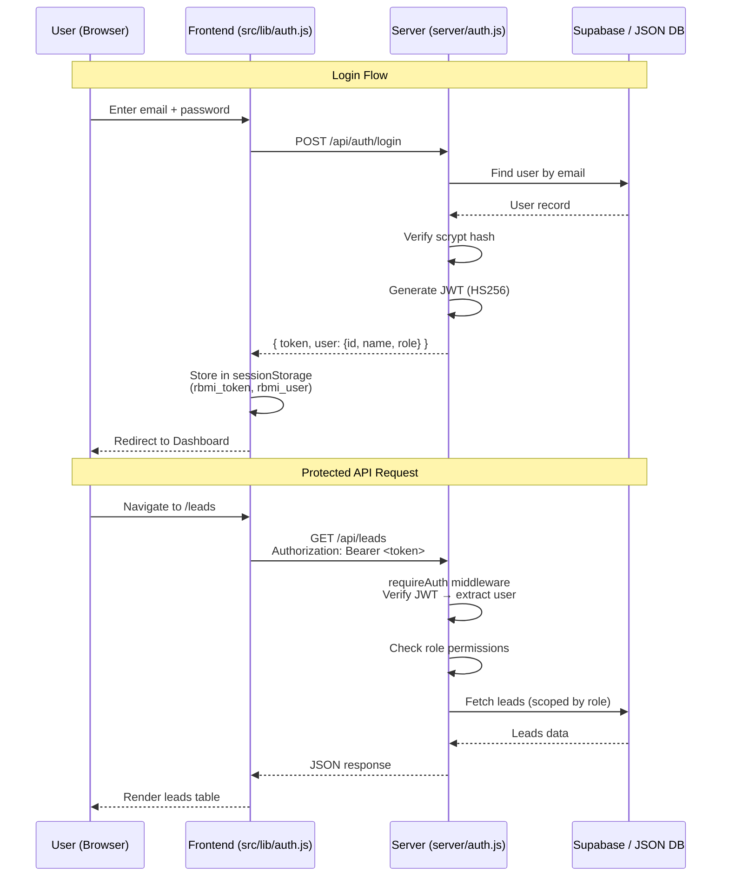

### Three User Roles

| Role | Access Level | Key Permissions |
|---|---|---|
| **Admin** | Full Access (`*`) | All pages, user management, settings, delete operations, bulk actions |
| **Counselor** | Limited Access | Dashboard, assigned leads, pipeline, applications, marketing, calendar, AI |
| **Student** | Self-Service | Portal, own applications, courses, payments, queries, AI assistant |

### Demo Accounts (Seeded)
| Email | Role |
|---|---|
| `admin@rbmi.edu.in` | Admin |
| `priya@rbmi.edu.in` | Counselor |
| `rajesh@rbmi.edu.in` | Counselor |
| `student@demo.in` | Student |

---

## 6. 📊 Lead Management Workflow

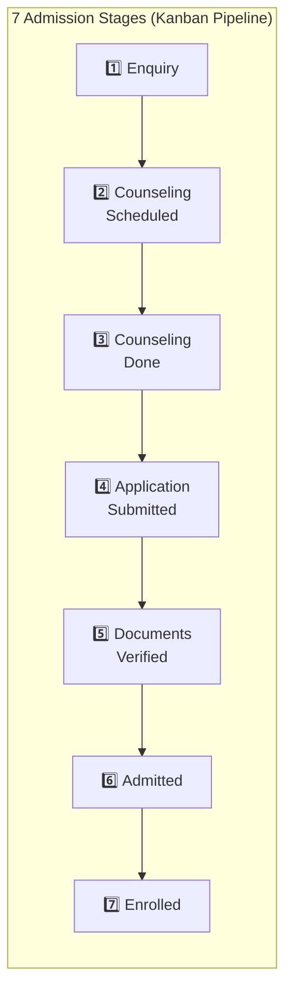

### Lead Operations
- **Create**: Manual form or webhook ingestion
- **Search**: Full-text search across name, email, phone
- **Filter**: By stage, source, counselor, priority, date range
- **Sort**: By name, date, stage, priority
- **Bulk Actions**: Bulk delete, bulk stage change, bulk counselor re-assign
- **Export**: CSV download with applied filters
- **Import**: CSV upload with duplicate checking & validation
- **Scoring**: Auto-calculated lead score (Base 20 + Source + Priority + Stage bonuses)
- **Strength**: Auto-classified as `Hot`, `Warm`, `Nurture`, `Cold`

---

## 7. 📥 Multi-Source Lead Ingestion

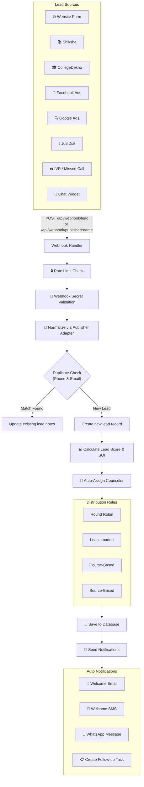

### Supported Publishers & Field Mapping
| Publisher | Name Field | Email Field | Phone Field |
|---|---|---|---|
| **Shiksha** | `FirstName` + `LastName` | `EmailId` | `MobileNo` |
| **CollegeDekho** | `student_name` | `student_email` | `student_mobile` |
| **Facebook Ads** | `full_name` (from `user_column_data`) | — | `phone_number` |
| **Google Ads** | `google_name` | `google_email` | `google_phone` |
| **JustDial** | `name` | — | `phone` |
| **IVR** | — | — | `CallerNumber` |

---

## 8. 👨‍💼 Counselor Admission Pipeline

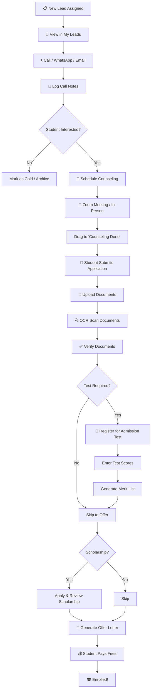

### Key Counselor Tools
- **Kanban Board**: Drag-and-drop stage transitions
- **Call Logging**: Record call duration, notes, outcomes
- **Task Manager**: Create follow-up reminders with SLA
- **Interview Scheduler**: Book Zoom or in-person meetings
- **OCR Document Scanner**: Auto-extract info from marksheets
- **Offer Letter Generator**: Template-based with `{{name}}`, `{{course}}` placeholders
- **AI Draft Responses**: AI-assisted query answering

---

## 9. 🎓 Student Self-Service Portal

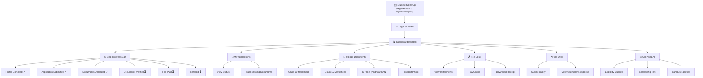

### Student Readiness Score
The portal calculates a **Readiness %** based on:
- Profile completion
- Application submission
- Document uploads & verification status
- Fee payment status

---

## 10. 📢 Marketing & Communication Engine

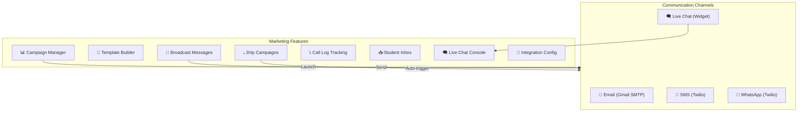

### Drip Campaign Workflow
```
Step 1: Welcome Email (Day 0)
    ↓ Wait 2 days
Step 2: Follow-up SMS (Day 2)
    ↓ Wait 3 days
Step 3: WhatsApp Reminder (Day 5)
    ↓ Wait 5 days
Step 4: Final Call-to-Action Email (Day 10)
```

---

## 11. 🤖 AI Assistant (Asha AI)

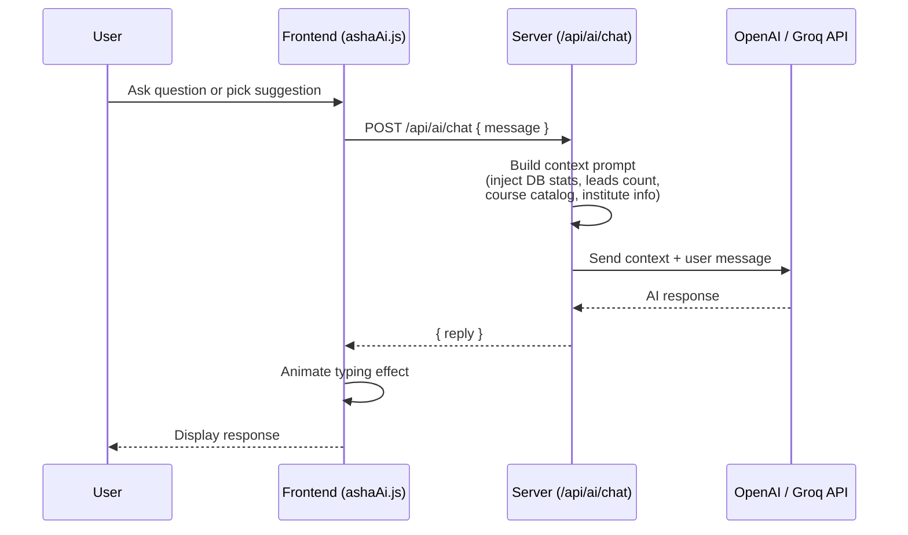

**Asha AI** is a context-aware assistant that:
- Knows the institute's courses, fees, and seat availability
- Can answer admission eligibility queries
- Helps counselors draft email/query responses
- Provides data-driven insights from lead statistics

---

## 12. 💰 Payment & Fee Management

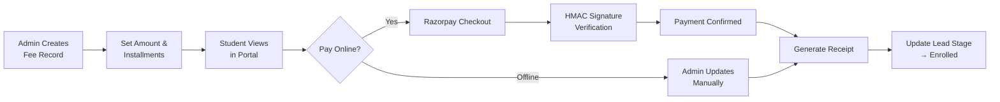

### Payment Features
- Installment schedule builder
- Due date tracking & overdue alerts
- Receipt generation
- CSV export of payment ledger
- Razorpay integration (mock/production)

---

## 13. 🗄 Database Schema

### Core Tables (Supabase PostgreSQL)

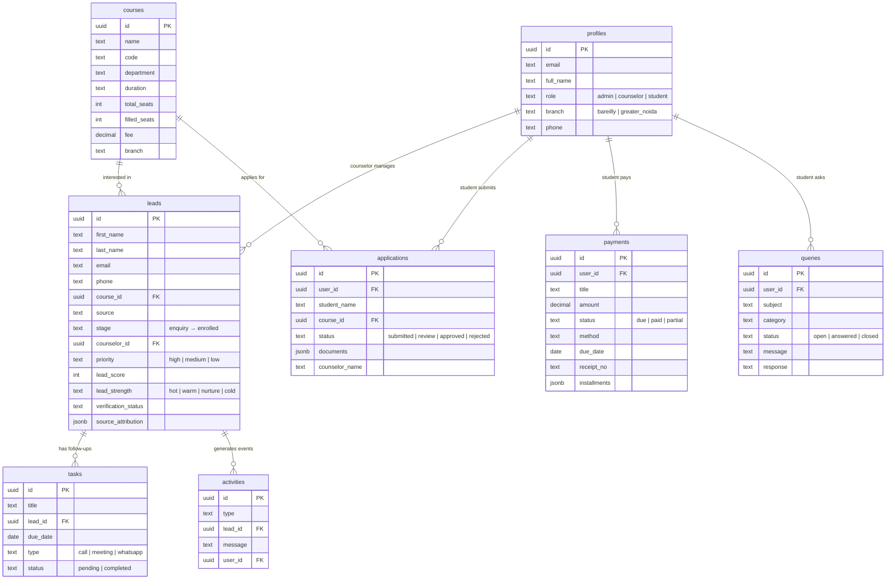

### Additional Tables
| Table | Purpose |
|---|---|
| `portal_profiles` | Student portal readiness cache |
| `institute_settings` | Key-value JSONB config storage |
| `form_templates` / `forms` | Dynamic form builder schemas |
| `campaigns` / `drip_campaigns` | Marketing sequence definitions |
| `letter_templates` | Offer letter HTML templates |
| `offer_letters` | Generated offer letters |
| `workflow_rules` | Automation trigger → condition → action rules |

### Row Level Security (RLS)
- **Admin**: Can read/write all records
- **Counselor**: Can only access leads assigned to them
- **Student**: Can only access their own applications, payments, queries

---

## 14. 🔌 Complete API Endpoints

### Authentication
| Method | Endpoint | Auth | Description |
|---|---|---|---|
| `POST` | `/api/auth/login` | Public | Email/Password login |
| `POST` | `/api/auth/supabase` | Public | Supabase OAuth token exchange |
| `POST` | `/api/auth/signup` | Public | Student self-registration |
| `GET` | `/api/auth/me` | Bearer | Current user profile |

### Users (Admin Only)
| Method | Endpoint | Description |
|---|---|---|
| `GET` | `/api/users` | List all users |
| `POST` | `/api/users` | Create user |
| `PUT` | `/api/users/:id` | Update user |
| `DELETE` | `/api/users/:id` | Delete user |

### Leads
| Method | Endpoint | Description |
|---|---|---|
| `GET` | `/api/leads` | List leads (search, filter, paginate) |
| `POST` | `/api/leads` | Create lead (auto-scored, auto-assigned) |
| `GET` | `/api/leads/:id` | Get lead details |
| `PUT` | `/api/leads/:id` | Update lead (triggers notifications) |
| `DELETE` | `/api/leads/:id` | Delete lead (Admin) |
| `POST` | `/api/leads/bulk-delete` | Bulk delete (Admin) |
| `GET` | `/api/leads/export/csv` | Export leads CSV |
| `GET` | `/api/pipeline` | Kanban pipeline data |

### Lead Import & Webhooks
| Method | Endpoint | Description |
|---|---|---|
| `POST` | `/api/import/leads` | Bulk CSV import |
| `GET` | `/api/import/template` | Download CSV template |
| `POST` | `/api/import/validate` | Validate CSV before import |
| `POST` | `/api/webhook/lead` | General inbound webhook |
| `POST` | `/api/webhook/publisher/:name` | Publisher-specific webhook |

### Courses & Counselors
| Method | Endpoint | Description |
|---|---|---|
| `GET/POST/PUT/DELETE` | `/api/courses[/:id]` | Course CRUD |
| `GET/POST/PUT/DELETE` | `/api/counselors[/:id]` | Counselor CRUD |

### Tasks & Activities
| Method | Endpoint | Description |
|---|---|---|
| `GET/POST/PUT/DELETE` | `/api/tasks[/:id]` | Task CRUD |
| `GET` | `/api/activities` | Activity audit stream |

### Student Portal
| Method | Endpoint | Description |
|---|---|---|
| `GET/PUT` | `/api/portal/profile` | Student profile & readiness |
| `GET/POST/PUT` | `/api/applications[/:id]` | Application management |
| `GET` | `/api/applications/export/csv` | Export applications |
| `POST` | `/api/upload` | File upload (documents) |

### Queries & Payments
| Method | Endpoint | Description |
|---|---|---|
| `GET/POST/PUT` | `/api/queries[/:id]` | Help desk tickets |
| `GET/POST/PUT` | `/api/payments[/:id]` | Fee management |
| `GET` | `/api/payments/export/csv` | Export payments |

### Marketing & Communication
| Method | Endpoint | Description |
|---|---|---|
| `GET` | `/api/marketing/overview` | Campaign metrics |
| `GET/POST/PUT` | `/api/marketing/templates[/:id]` | Message templates |
| `GET/POST/PUT` | `/api/marketing/campaigns[/:id]` | Campaigns |
| `POST` | `/api/marketing/campaigns/:id/launch` | Execute campaign |
| `GET/PUT` | `/api/marketing/integrations` | Provider credentials |
| `GET/POST` | `/api/marketing/call-logs` | Call tracking |
| `GET/POST` | `/api/marketing/broadcasts[/:id]` | Announcements |
| `POST` | `/api/marketing/broadcasts/:id/send` | Send broadcast |
| `GET/POST` | `/api/marketing/inbox` | Student inbox |
| `GET/POST` | `/api/chat/sessions[/:id/messages]` | Live chat |
| `GET/POST/PUT` | `/api/drip-campaigns[/:id]` | Drip sequences |

### Enterprise Modules
| Method | Endpoint | Description |
|---|---|---|
| `GET/POST` | `/api/admission-tests` | Test management |
| `POST` | `/api/admission-tests/register` | Register student |
| `POST` | `/api/admission-tests/result` | Submit scores |
| `GET` | `/api/admission-tests/:id/merit-list` | Merit list |
| `GET/POST` | `/api/scholarships` | Scholarship schemes |
| `POST` | `/api/scholarships/apply` | Apply for scholarship |
| `POST` | `/api/scholarships/review` | Approve/reject |
| `GET/POST` | `/api/batches` | Batch management |
| `POST` | `/api/batches/assign` | Assign student to batch |
| `GET` | `/api/batches/students` | Batch roster |
| `POST` | `/api/reports/generate` | Custom reports |
| `POST` | `/api/reports/schedule` | Scheduled reports |
| `GET/POST` | `/api/interviews` | Interview booking |
| `GET` | `/api/interviews/slots` | Available slots |
| `POST` | `/api/payment-gateway/order` | Razorpay order |
| `POST` | `/api/payment-gateway/verify` | Verify payment |
| `GET/POST` | `/api/saved-filters` | Filter presets |
| `GET/POST` | `/api/lead-distribution/rules` | Lead routing rules |
| `POST` | `/api/utm/track` | UTM analytics tracking |
| `GET` | `/api/utm/analytics` | Campaign source stats |
| `GET/POST` | `/api/forms[/:id/embed]` | Dynamic form builder |
| `POST` | `/api/ai/chat` | Asha AI assistant |

---

## 15. 🖥 Frontend Pages & Components

### All 29 Pages

| # | Route | Page | Role Access | Description |
|---|---|---|---|---|
| 1 | `#/login` | Login | Public | 3D animated login with tabs |
| 2 | `#/dashboard` | Dashboard | Admin, Counselor | KPI cards, charts, activity feed |
| 3 | `#/leads` | Leads | Admin, Counselor | Lead management table |
| 4 | `#/pipeline` | Pipeline | Admin, Counselor | Kanban drag-and-drop |
| 5 | `#/applications` | Applications | All | Application & doc verification |
| 6 | `#/counselors` | Counselors | Admin | Counselor team management |
| 7 | `#/courses` | Courses | All | Program catalog |
| 8 | `#/reports` | Reports | Admin | Analytics & conversion funnel |
| 9 | `#/settings` | Settings | Admin | 9-tab configuration center |
| 10 | `#/portal` | Student Portal | Student | Self-service admission hub |
| 11 | `#/queries` | Queries | All | Help desk tickets |
| 12 | `#/payments` | Payments | All | Fee desk & receipts |
| 13 | `#/marketing` | Marketing | Admin, Counselor | Multi-channel campaigns |
| 14 | `#/student-inbox` | Student Inbox | Admin, Counselor | Unified messaging |
| 15 | `#/chat-sessions` | Chat Sessions | Admin, Counselor | Live chat monitor |
| 16 | `#/drip-campaigns` | Drip Campaigns | Admin, Counselor | Auto-nurture sequences |
| 17 | `#/form-builder` | Form Builder | Admin | Custom form creator |
| 18 | `#/form/:id` | Public Form | Public | Dynamic lead form |
| 19 | `#/admission-tests` | Admission Tests | All | Test & merit list |
| 20 | `#/scholarships` | Scholarships | All | Financial aid management |
| 21 | `#/batches` | Batches | Admin, Counselor | Academic cohorts |
| 22 | `#/lead-distribution` | Lead Distribution | Admin, Counselor | Auto-routing rules |
| 23 | `#/notifications` | Notifications | All | Notification center |
| 24 | `#/call-logs` | Call Logs | Admin, Counselor | Telephony tracking |
| 25 | `#/sqi` | Student Quality Index | Admin, Counselor | Predictive analytics |
| 26 | `#/user-dashboard` | User Dashboard | Admin, Counselor | Counselor productivity |
| 27 | `#/audit-log` | Audit Log | Admin | Security event log |
| 28 | `#/calendar` | Calendar | Admin, Counselor | Scheduling |
| 29 | `#/ai-assistant` | AI Assistant | All | Asha AI standalone |
| 30 | `#/download` | Download | All | Mobile app showcase |

---

## 16. 🚀 Deployment Architecture

### Vercel Deployment

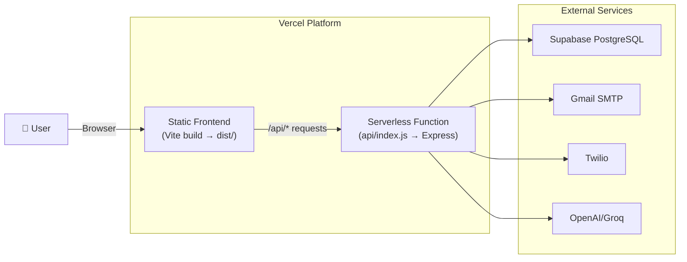

### Files Created for Deployment
- **`vercel.json`**: Routes `/api/*` → serverless function, everything else → `index.html` (SPA)
- **`api/index.js`**: Re-exports Express app as serverless handler

### Environment Variables (Set in Vercel Dashboard)
```
PORT=3001
JWT_SECRET=<your-secret>
SUPABASE_URL=https://your-project.supabase.co
SUPABASE_ANON_KEY=<key>
SUPABASE_SERVICE_ROLE_KEY=<key>
VITE_SUPABASE_URL=https://your-project.supabase.co
VITE_SUPABASE_ANON_KEY=<key>
WEBHOOK_SECRET=<secret>
GMAIL_USER=<email>
GMAIL_APP_PASSWORD=<app-password>
LLM_API_KEY=<openai-key>
TWILIO_ACCOUNT_SID=<sid>
TWILIO_AUTH_TOKEN=<token>
```

### Deploy Commands
```bash
# Login to Vercel
vercel login

# Deploy (preview)
vercel

# Deploy to production
vercel --prod
```

---

## 📊 Complete Workflow Summary

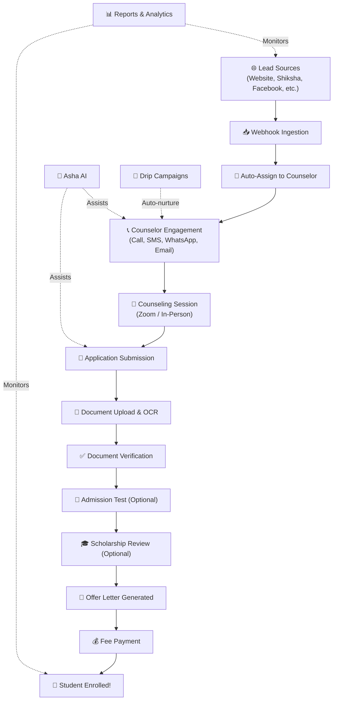

---

> **Built with ❤️ for RBMI — Rakshpal Bahadur Management Institute**
